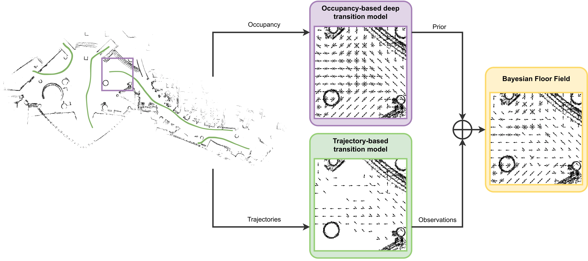

# Bayesian Floor Field



[](https://arxiv.org/abs/2208.10851)
[](https://www.python.org/downloads/)
[](https://pytorch.org/get-started/previous-versions/)
[](https://developer.nvidia.com/cuda-11-8-0-download-archive)
[](./LICENSE)

**Authors:** [Francesco
Verdoja](https://research.aalto.fi/en/persons/francesco-verdoja) (<francesco.verdoja@aalto.fi>), [Tomasz Piotr
Kucner](https://research.aalto.fi/en/persons/tomasz-kucner), and [Ville
Kyrki](https://research.aalto.fi/en/persons/ville-kyrki)\
**Affiliation:** School of Electrical Engineering, Aalto University, Finland

Bayesian Floor Field (BFF) is a novel approach to learn people flow able to
combine knowledge about the environment geometry with observations from human
trajectories. An occupancy-based deep prior is used to build an initial
transition model without requiring any observations of pedestrians; the model
is then updated when observations become available using Bayesian inference. We
demonstrate the ability of our model to increase data efficiency and to
generalize across real large-scale environments, which is unprecedented for
maps of dynamics.

## Installation

### Software requirements

* Python 3.9
* PyTorch 1.9.1
* CUDA 11.8

A complete list of dependencies is listed in `requirements.txt` and should be
installed for the software to run.\
If you are interested in running the tests or doing development, you should
also install the dependencies in `requirements-dev.txt`.

### Submodules

Our Tiramisu network implementation is based on
[OctoPyTorch](https://github.com/npielawski/octopytorch). We incorporate
OctoPyTorch as [git
submodule](https://git-scm.com/book/en/v2/Git-Tools-Submodules). To pull the
submodule, after cloning this project, you just have to run:

```sh
git submodule update --init --recursive
```

## Reproducing the results of the paper

### Data

[Link to download the data and
models](https://drive.google.com/file/d/1CvVC7Yi0oEcP41VYUtsyJj13uc30tIn2/view?usp=sharing) (695 MB)

#### Data structure

```bash
BFF_data_models.zip
│   LICENSE  # MIT licence
│   README.md  # data description
│
├───data  # folder containing datasets
│   ├───ATC  # ATC dataset
│   │   │   localization_grid.pgm  # occupancy map image
│   │   │   localization_grid.yaml  # occupancy map metadata
│   │   │
│   │   └───subsampled
│   │           atc-20121114_5.csv  # curated data from 11/14/2012 (training)
│   │           atc-20121118_5.csv  # curated data from 11/18/2012 (testing)
│   │
│   └───KTH_track  # KTH dataset
│           kth_trajectory_data.csv  # curated data, consistent with ATC format
│           map.pgm  # occupancy map image
│           map.yaml  # occupancy map metadata
│
├───maps  # occupancy-based prior maps
│       map_atc_w64_s8_t_120.npy
│       map_atc_w64_s16_t_120.npy
│       map_atc_w64_s20_t_120.npy
│       map_kth_w64_s8_t_120.npy
│       map_kth_w64_s16_t_120.npy
│       map_kth_w64_s20_t_120.npy
│
└───models  # pretrained network weights for the occupancy-based prior
        people_net_w64_s8_t_120.pth
        people_net_w64_s16_t_120.pth
        people_net_w64_s20_t_120.pth
```

In our experiments we used the following two datasets:

* **[ATC pedestrian tracking
  dataset](https://dil.atr.jp/crest2010_HRI/ATC_dataset/) (ATC)**: this dataset
  comprises of 92 days in total. For our experiments, we only used data from
  Wednesday November 14th, 2012 (training) and Saturday November 18th, 2012
  (testing). Moreover, we curated the data for ease of processing, downsampling
  the amount of measurements by a factor of 5. We provide our curated datasets
  in the `data/ATC/subsampled` folder. The occupancy map for ATC is found in
  the `data/ATC` folder.
* **[KTH track
  dataset](https://strands.readthedocs.io/en/latest/datasets/people_tracks.html)
  (KTH)**: we curated this dataset to make it consistent with the ATC format.
  We provide our curated datasets in the `data/KTH_track` folder. The occupancy
  map for KTH is found in the same folder.

Moreover, in the `models` folder, we provide the pretrained network models for
the occupancy-based prior, used in the experiments. The filenames for these
models follow the structure
`people_net_w{window_size}_s{scale_factor}_t_{number_of_training_epochs}.pth`

Finally, in the `maps` folder, we provide the precomputed occupancy-based prior
MoDs obtained by using each of the deep models on each environment. The
filenames for these maps follow the structure
`map_{dataset}_w{window_size}_s{scale_factor}_t_{number_of_training_epochs}.npy`

For both `models` and `maps`, the `scale_factor` is indicated as multiplier
from the occupancy map scale of 0.05m/pixel, so `s8 => 8x0.05 = 0.4m/cell`
corresponds to the prior $\bar{\textbf{d}}_{0.4}^W$ from the paper, `s16 =>
16x0.05 = 0.8m/cell` to $\bar{\textbf{d}}_{0.8}^W$ and `s20 => 20x0.05 =
1.0m/cell` to $\bar{\textbf{d}}_{1.0}^W$.

### Replicating the experiments

Once you have downloaded the data and ensure paths are correct, you can use the
scripts in this codebase to replicate our experiments, following these steps:

  1. Run `build_bayesian_discrete_directional_atc.py` and
     `build_bayesian_discrete_directional_kth.py` to generate the
     trajectory-based floor field models from the curated data.
  2. *(optional)* Run `training_atc.py` to train your own occupancy-based prior
     network. This step can be skipped by using the provided pretrained models.
  3. *(optional)* Run `map_occupancy_prior_atc.py` and
     `map_occupancy_prior_kth.py` to build the MoDs for the occupancy-based
     prior. This step can be skipped by using the provided precomputed maps.
  4. Run `compute_curves_atc.py` and `compute_curves_kth.py` to compute the
     likelihood performance of BFF compared to the trajectory-based floor field
     model without occupancy-based prior.
  5. Run `plot_curves.py` to obtain the plots presented in Fig. 3 in the paper.
  6. Run `plot_quivers_atc.py` and `plot_quivers_kth.py` to obtain the plots
     presented in Fig. 4 in the paper.

## Citation

If you find this work useful, please consider citing:

```bibtex
@misc{verdoja_2024_bayesian_floor_field,
  title = {Bayesian Floor Field: Transferring people flow predictions across environments},
  author = {Verdoja, Francesco and Kucner, Tomasz Piotr and Kyrki, Ville},
  publisher = {arXiv},
  year = {2024},
  url = {https://arxiv.org/abs/2208.10851},
  doi = {10.48550/ARXIV.2208.10851},
  copyright = {Creative Commons Attribution Non Commercial No Derivatives 4.0 International}
}
```

Moreover, if you use OctoPytorch, or either dataset mentioned above, please
consider citing the original authors as well.

<details>
<summary>List of citations</summary>

```bibtex
@article{brvsvcic_2013_atc,
  title={Person tracking in large public spaces using 3-D range sensors},
  author={Br{\v{s}}{\v{c}}i{\'c}, Dra{\v{z}}en and Kanda, Takayuki and Ikeda, Tetsushi and Miyashita, Takahiro},
  journal={IEEE Transactions on Human-Machine Systems},
  volume={43},
  number={6},
  pages={522--534},
  year={2013},
  publisher={IEEE}
}

@inproceedings{dondrup_2015_kth,
  title = {Real-Time Multisensor People Tracking for Human-Robot Spatial Interaction},
  author = {Dondrup, Christian and Bellotto, Nicola and Jovan, Ferdian and Hanheide, Marc},
  booktitle = {International Conference on Robotics and Automation (ICRA) - Workshop on Machine Learning for Social Robotics},
  year = {2015}
}

@inproceedings{Jegou_2017_tiramisu,
  title = {The One Hundred Layers Tiramisu: Fully Convolutional DenseNets for Semantic Segmentation}, 
  author = {Jégou, Simon and Drozdzal, Michal and Vazquez, David and Romero, Adriana and Bengio, Yoshua},
  booktitle = {2017 IEEE Conference on Computer Vision and Pattern Recognition Workshops (CVPRW)}, 
  year = {2017},
  pages = {1175-1183},
  doi = {10.1109/CVPRW.2017.156}
}
```

</details>

## Acknowledgements

This work is part of the [Hypermaps
project](https://research.fi/en/results/funding/78102) and was supported by the
Research Council of Finland, decision 354909.\
We gratefully acknowledge the support of NVIDIA Corporation with the donation
of the Titan Xp GPU used for this research.
